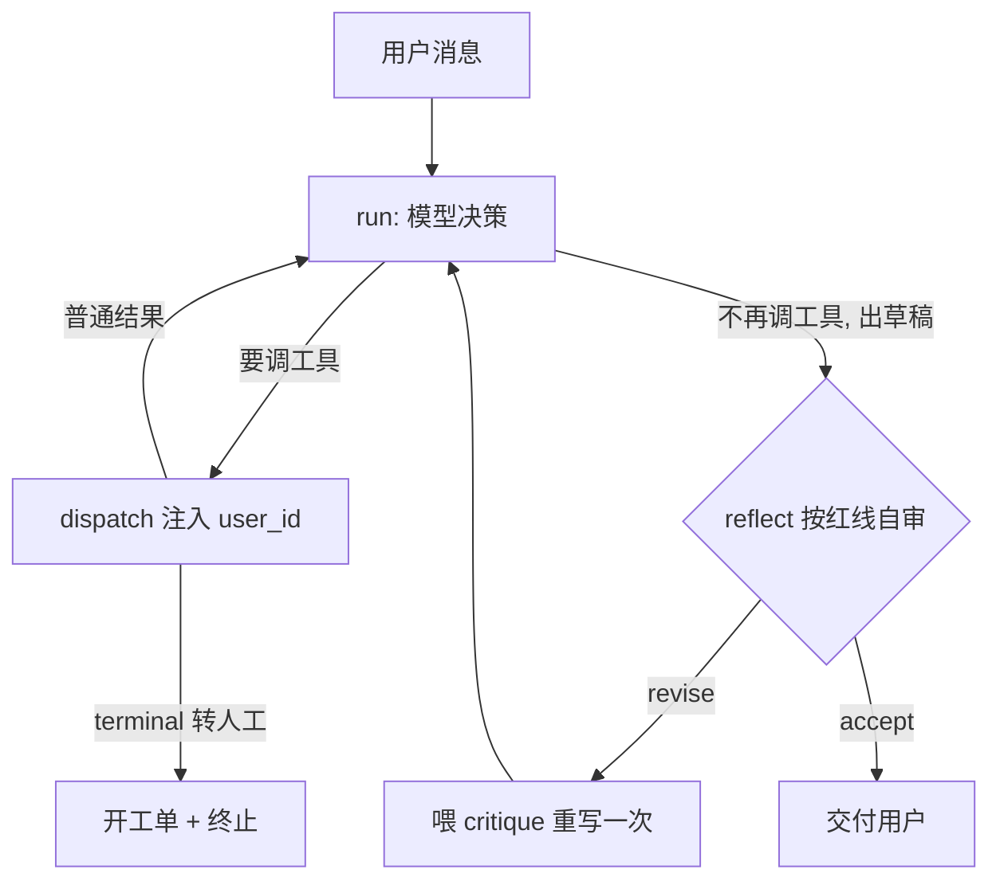

# 电商售后智能客服 Agent

> 一个**生产级思路**的客服 Agent：能查订单、办退款、答政策、转人工，
> 带**三道安全线**、**Planning-Acting-Reflection 闭环**，可**容器化部署**。
> 裸 SDK 手写编排（不依赖框架黑盒），每个组件都能讲清为什么这么设计。

个人项目 · 2026.06–2026.08 · Python 3.12 / DeepSeek + OpenAI embedding / FastAPI + Docker

---

## 它能做什么

| 能力 | 说明 | 关键设计 |
|---|---|---|
| **订单查询** | 查状态/物流/金额 | 归属校验，只返回本人订单 |
| **退款办理** | 高危写操作 | 金额阈值 + 幂等 **代码层 hard-code**，不交模型判断 |
| **政策答疑** | 退换货/运费/发票 | RAG + 相似度阈值，检索不到就转人工不硬答 |
| **转人工** | 兜底 | 开**审计工单** + 终止 loop |

## 亮点（面试可展开）

- 🔒 **三道安全线**：越权注入防御 · 退款阈值 hard-code · RAG 幻觉阈值——**可靠性来自代码约束，不赌模型自觉**。
- 🔁 **Planning-Acting-Reflection 闭环**：答复交付前 LLM-as-judge 按红线自审、不合格自动重写；质量层 **fail-open** 不拖垮已有安全线。
- 🧭 **框架有据可依**：裸 SDK vs LangGraph 双实现 + [选型 ADR](ADR-001-langgraph-vs-bare-sdk.md)。
- 🔌 **MCP 边界安全**：包成 MCP 工具后身份改由 server 端注入，拦截调用方越权。
- 🚀 **服务化部署**：FastAPI + Docker，身份走认证注入、key 运行时注入、故障优雅降级。
- ✅ **可测**：16 条正反 pytest，mock/monkeypatch 隔离网络，**拔网线也能跑绿**。

---

## 架构

```
用户 ── HTTP ──▶ app.py (FastAPI)
                  │  认证：X-User-Token → user_id（身份不从请求体信任）
                  ▼
              agent.py  run() = ReAct 循环 + LoopGuard 闸门 + Reflection 出口
                  │  dispatch()：注入 session user_id
        ┌─────────┼───────────────┬──────────────┐
        ▼         ▼               ▼              ▼
   query_order  process_refund  search_policy  escalate_to_human
   (归属校验)   (阈值+幂等)      (RAG+阈值)     (工单+终态)
                                  │
                                policy_rag.py：chunk + embedding + ChromaDB + grounding
```

**核心链路（含反思闭环）**：



| 文件 | 职责 |
|---|---|
| `tools.py` | 工具层：归属校验 / 阈值 hard-code / 审计工单 |
| `policy_rag.py` | 政策 RAG：检索 + 阈值闸 + grounding 生成（client 惰性化） |
| `reflect.py` | 反思节点：LLM-as-judge 质检，依赖注入可 mock，fail-open |
| `agent.py` | 编排：SYSTEM_PROMPT / TOOLS schema / dispatch / run 循环 |
| `app.py` | 部署：FastAPI `/chat` + `/health` + 认证 |
| `agent_langgraph.py` | 同一循环的 LangGraph 版（对比用，见 ADR） |
| `test_*.py` | 16 条正反用例 |

---

## 三道安全线（本项目的标志）

1. **越权注入防御**：`user_id` 由代码从会话/认证注入，工具 schema **不暴露** user_id、请求体**不含** user_id。攻击者伪造身份（改 body / 塞参数）一律失败。同一纪律贯穿 工具 → MCP server → HTTP 三层。
2. **退款阈值 hard-code**：能不能退、退多少由代码 `if amount > REFUND_AUTO_LIMIT` 判 + 幂等防重复退，**不写进 prompt 让模型"注意别退超"**——确定性红线不用概率手段守。
3. **RAG 幻觉阈值**：检索相似度超阈值判"没覆盖"转人工，阈值**从 18 条四分区评估集的距离分布标定**（修正过一次误踢正例长尾的旧阈值）。

---

## 快速开始

需要两个 key：`DEEPSEEK_API_KEY`（对话）、`OPENAI_API_KEY`（embedding）。

```bash
# 环境（仓库根 uv 项目）
uv sync

# 命令行跑 6 场景 demo
uv run python main.py

# 测试（在本目录跑，monorepo 分目录隔离）
uv run pytest -q          # 16 passed

# 服务化：本地起 API
uv run uvicorn app:app --host 127.0.0.1 --port 8071
curl -X POST http://127.0.0.1:8071/chat \
  -H "Content-Type: application/json" -H "X-User-Token: tok_zhang" \
  -d '{"message":"我的订单 A123 到哪了？"}'

# 容器化部署（key 运行时注入，不烤进镜像）
docker build -t cs-agent .
docker run --rm -p 8071:8000 \
  -e DEEPSEEK_API_KEY=$DEEPSEEK_API_KEY -e OPENAI_API_KEY=$OPENAI_API_KEY cs-agent
```

---

## 设计决策（深度阅读）

- [DESIGN.md](DESIGN.md) —— 需求澄清 7 维度、五块架构蓝图、被压力追问纠正的取舍。
- [ADR-001](ADR-001-langgraph-vs-bare-sdk.md) —— 裸 SDK vs LangGraph 选型（结论：编排层用裸 SDK）。

**几个关键取舍**：

| 决策 | 选择 | 为什么 |
|---|---|---|
| 意图分流 | function-calling 隐式分派 | 当前四工具够用；显式 intent 分类器留作扩展 |
| 退款判断 | 代码 hard-code | 可靠性来自约束，不赌模型 |
| 编排层 | 裸 SDK（非 LangGraph） | 框架招牌价值当前用不上 + 安全注入要写自定义节点，见 ADR |
| 反思故障 | fail-open | 质量层不拖垮已执行的安全线 |
| 外部 client | 惰性初始化 | import 期不做会失败的副作用，缺 key 也能起 `/health` |

## 已知简化 / 未来增强

- 假数据（订单表 / 政策库 / 工单台账）用内存结构，真实项目接数据库 / 工单系统。
- 认证用 token→user_id 映射表模拟，生产接 JWT / OAuth。
- 反思跨会话不存记忆（Self-Refine 形态）；更重的 Reflexion（失败轨迹存 memory 重试）留作研究向增强。
- 三档 confidence-band 澄清路由（检索"沟里"让用户 rephrase）已设计，见 DESIGN 未来增强。
